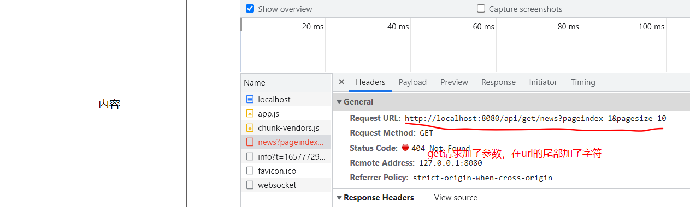

### ockjs是什么

是什么：拦截Ajax，随机生成数据

用来模拟后端接口，随机返回数据

等后端有接口，产品上线的时候，主要注释掉mock模拟的后端接口即可，注释掉mian.js中的import './mock/index'

### mockjs的官方文档

http://mockjs.com/

### 创建vue脚手架项目

```
vue create mock-demo
```

#### 使用mockjs

项目安装mock

```
cnpm install mockjs
```

在src文件下新建mock文件，新建index.js

```js
//引入mock模块
import Mock from 'mockjs'
```

将mock文件在main.js中导入

直接引入不需要 命名什么模块名称 使用from

```js
import Vue from 'vue'
import App from './App.vue'
import './mock/index.js'

Vue.config.productionTip = false

new Vue({
	render:h => h(App),
}).$mount('#app')
```

#### mock的随机内容生成语法

格式 Mock.mock({

})

##### 生成字符串

- 生成指定次数字符串

```js
import Mock from 'mockjs'
const data = Mock.mock({
"string|4":"哈哈"
})
```

- 生成指定范围长度字符串

```js
const data = Mock.mock({
"string|1-8":"哈哈"
})
```

##### 生成文本

- 生成一个随机字符串

```js
const data = Mock.mock({
	"string":"@cword"
}) 
```

- 生成指定长度和范围

```js
const data = Mock.mock({
    string:"@cword(1)"
    str :"@cword(10,15)"
})
```

##### 生成标题和句子

- 生成标题和句子

```js
const data = Mock.mock({
    title:"@ctitle(8)"
    sentence:"@csentence"
})
```

- 生成指定长度的标题和句子

```js
const data = Mock.mock({
    title:"@ctitle(8)"
    sentence:"@csentence(50)"
})
```

- 生成指定范围的

```js
const data = Mock.mock({
    title:"@ctitle(5,8)"
    sentence:"@csentence(50,100)"
})
```

##### 生成段落

- 随机生成段落

```js
const data = Mock.mock({
  content:"@cparagraph()"
})
```

##### 生成数字

- 生成指定数字

```js
const data = Mock.mock({
	"number|80":1
})
```

- 生成范围数字

```js
const data = Mock.mock({
	"number|1-99":1
})
```

##### 生成自增id

- 随机生成标识

```js
const data = Mock.mock({
	id:"@increment"
})
```

##### 生成姓名-地址-身份证

- 随机生成姓名-地址-身份证

```js
const data = Mock.mock({
	name:"@cname()"
	idCard:"@id()"
	address:"@city(true)"
})
```

##### 随机生成图片

```JavaScript
"img_url": "@image('50*50','#FF83FA','#FCFCFC','png','mono')",
```

- 生成图片：@image（“300*200”，‘#ff0000','#fff','gif','坤坤'）
- 参数1：图片大小

```
[
	'300*250','250*250','240*400','336*280'
	'180*150','720*300','468*60','234*60'
	'388*31','250*250','240*400','120*40'
	'125*125','250*250','240*400','336*280'
]
```

- 参数2：图片背景色

- 参数3：图片前景色

- 参数4：图片格式
- 参数5：图片文字

##### 生成时间

- @Date
- 生成指定格式时间：@date(yyyy-MM-dd hh:mm:ss)

指定数组返回的参数

- 指定长度：‘date|5’
- 指定范围:'data|5-10'

```js
const data = Mock.mock({
'add_time':"@date(yyyy-MM-dd hh:mm:ss)"
})
```

#### mock拦截请求

#### 安装axios，发起请求

```
cnpm i axios
```

在App.vue中引入axios，发起请求

```JavaScript
<template>
  <div></div>
</template>
<script>
import axios from 'axios'
export default {

created(){
  axios.get('api/get/news').then(res=>{ console.log(res.data);}
)
}
  
}
</script>
```

##### 定义get请求

mock发起请求的三个参数，第一个是url地址，第二个是请求的方式，第三个是请求返回的数据，书写的格式可以是{内容}，也可以是（）=>{return{内容}}

```js
Mock.mock('api/get/news','get',{
        status:200,
        message:"获取数据成功"
    }
)
```

##### 定义post请求

```js
Mock.mock('api/post/news','post',()=>{
    return{
        status:200,
        message:"post获取数据成功"
    }
})
```

#### 实现新闻管理案例

##### 获取数据

接口地址：：/api/get/news

接口参数：

```
pageindex：页码
pagesize:每页的条数
```

请求类型：get

返回的数据：

```json
{
    status:200,
        message:"获取新闻列表成功",
        list:[
        {
            "id":1,
            "title":"解忧杂货店",
            "content":"《解忧杂货店》是日本作家东野圭吾写作的长篇小说。2011年《小说野性时代》连载，于2012年3月由角川书店发行单行本",
            "img_url":"http://t15.baidu.com/it/u=2090705107,20534764&fm=224&app=112&f=JPEG?w=500&h=500&s=61D0718656561FFFE504A51703000067",
            "add_time":"1984-04-03 11:43:37"}
        ],
        total:50
    }
}
```

```

```

App.vue中axios发起请求

```JavaScript
 //获取新闻列表数据
    getNewsList() {
      axios
        .get("/api/get/news", {
          params: {
            pageindex: this.pageindex,
            pagesize: 10,
          },
        })
        .then((res) => {
          console.log("新闻数据列表",res);
          this.list = res.data.list;
        });
    },
```

get发起请求添加参数，会在url后面添加字符串，跟mock模拟的后端的接口地址不同，因此mock后面的url使用正则表达式




mock的接口url地址使用正则表达式，url不用加单引号包裹

```JavaScript
Mock.mock(/\/api\/get\/news/,'get',()=>{
    return{
        status:200,
            message:"获取新闻列表成功",
            list: newlist,
            total:newlist.length
        }
    }
)
```


##### 添加新闻

信息添加的index也是按照原理的顺序增加


接口地址：：/api/add/news

接口参数：

```
title：'标题'
content：内容
```

请求类型：post

返回的数据：

```json
{
    status:200,
        message:"获取新闻列表成功",
        list:[
        {
            "id":1,
            "title":"解忧杂货店",
            "content":"《解忧杂货店》是日本作家东野圭吾写作的长篇小说。2011年《小说野性时代》连载，于2012年3月由角川书店发行单行本",
            "img_url":"http://t15.baidu.com/it/u=2090705107,20534764&fm=224&app=112&f=JPEG?w=500&h=500&s=61D0718656561FFFE504A51703000067",
            "add_time":"1984-04-03 11:43:37"}
        ],
        total:50
    }
}
```


##### 删除新闻

条数是减少，但是页面显示是没有变化的

接口地址：：/api/delete/news

接口参数：

```
id；新闻id
```

请求类型：post

返回的数据：

```
{
    status:200,
        message:"获取新闻列表成功",
        list:[
        {
            "id":1,
            "title":"解忧杂货店",
            "content":"《解忧杂货店》是日本作家东野圭吾写作的长篇小说。2011年《小说野性时代》连载，于2012年3月由角川书店发行单行本",
            "img_url":"http://t15.baidu.com/it/u=2090705107,20534764&fm=224&app=112&f=JPEG?w=500&h=500&s=61D0718656561FFFE504A51703000067",
            "add_time":"1984-04-03 11:43:37"}
        ],
        total:50
    }
}
```

